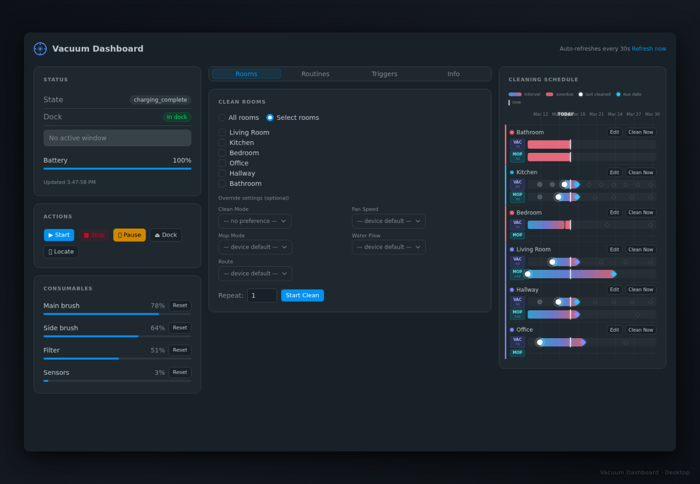
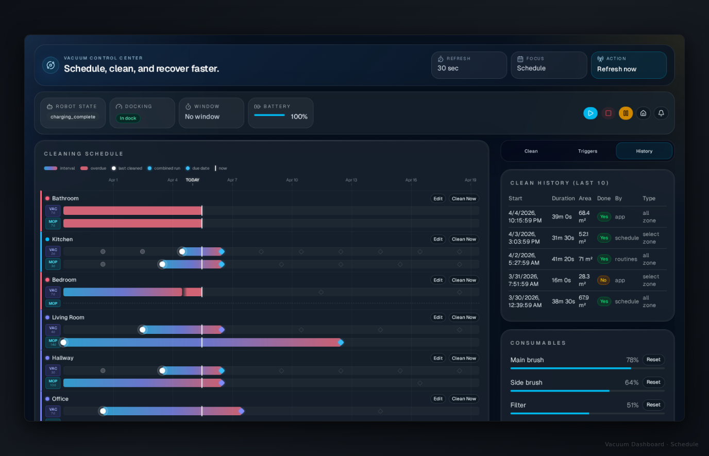
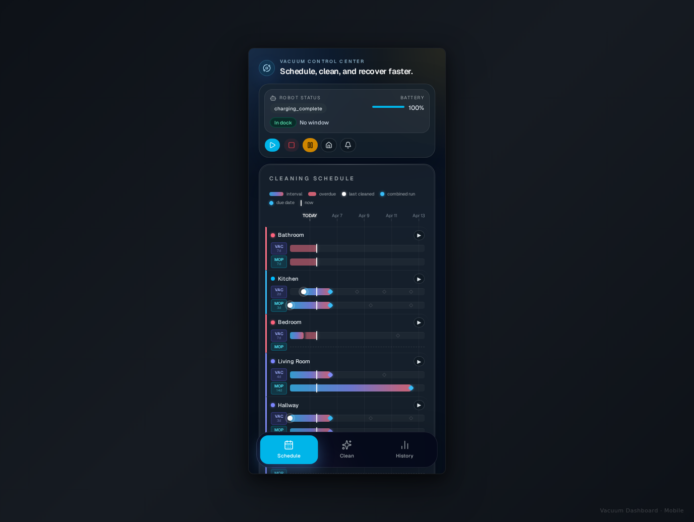

# saros-dashboard

[](LICENSE)



CLI, MCP server, and web dashboard for the **Roborock Saros 10R** robot vacuum, built on top of [`python-roborock`](https://github.com/Python-roborock/python-roborock). Control cleaning, monitor status, manage schedules, and query history — all from the terminal, your browser, or an AI assistant.

> **Cloud API only.** The Saros 10R uses a newer local protocol not yet supported by `python-roborock`. All commands are relayed through Roborock's cloud MQTT broker (`usiot.roborock.com:8883`), even when the device is on the same LAN. See [Connectivity](#connectivity) for details.

Current scheduler follow-up work is tracked in [docs/scheduler-reliability-plan.md](/home/openclaw/code/vacuum/docs/scheduler-reliability-plan.md).

---

## Features

- **CLI** (`vacuum`) — status, start/stop/pause/dock, room selection, routines, consumables, history
- **Web dashboard** (`vacuum-dashboard`) — full-featured browser UI with scheduling, clean history, consumable gauges, and per-room cleaning intervals
- **MCP server** (`vacuum-mcp`) — exposes vacuum tools to AI assistants via the [Model Context Protocol](https://modelcontextprotocol.io) (works with Claude Desktop)
- **Scheduling** — SQLite-backed per-room cleaning intervals with overdue detection and priority scoring
- **Clean history** — paginated history with duration, area, and completion status
- **Consumables** — percentage-remaining gauges for main brush, side brush, filter, and sensor

| Schedule (Gantt) | Mobile |
|---|---|
|  |  |

---

## Requirements

- Python 3.11+
- A Roborock account (the same login used in the Roborock app)
- A Roborock Saros 10R (other Roborock devices may work but are untested)
- Internet access (cloud API)

---

## Setup

**1. Install**

```bash
git clone https://github.com/yourusername/saros-dashboard
cd saros-dashboard
pip install -e .
```

**2. Configure credentials**

```bash
cp .env.example .env
# Edit .env and fill in your Roborock username and password
```

`.env` contents:
```
ROBOROCK_USERNAME=your@email.com
ROBOROCK_PASSWORD=yourpassword
ROBOROCK_DEVICE_NAME=           # optional — defaults to first device found
```

**3. Authenticate**

```bash
vacuum login        # use this if password login doesn't work (triggers email code flow)
```

After first login, the session token is cached at `.roborock_session.json`. Subsequent runs skip the login round-trip.

---

## Usage

### CLI

```bash
vacuum status                        # Current state, battery, dock status
vacuum clean                         # Start a full home clean
vacuum stop                          # Stop cleaning
vacuum pause                         # Pause in place
vacuum dock                          # Return to dock
vacuum locate                        # Play locator sound
vacuum map                           # Show rooms and segment IDs
vacuum rooms "Kitchen" "Living room" # Clean specific rooms
vacuum rooms "Kitchen" --repeat 2   # Clean a room twice
vacuum sequence                      # Raw clean-sequence / segment-status diagnostics
vacuum map-debug                     # Charger/room coordinates and dock-distance ranking
vacuum test-order "Kitchen" "Hall" --dry-run  # Show exact ordered room payload
vacuum routine --list                # List available routines
vacuum routine "morning-clean"       # Run a named routine
vacuum history                       # Recent clean history
vacuum consumables                   # Brush / filter / sensor wear
```

`vacuum test-order` is a diagnostic tool only. Physical testing on April 11, 2026 showed that the Saros 10R did not reliably follow the submitted room list order for `APP_SEGMENT_CLEAN`; see [docs/scheduler-reliability-plan.md](/home/openclaw/code/vacuum/docs/scheduler-reliability-plan.md).

### Web dashboard

```bash
vacuum-dashboard                     # Start on default port 9103
make install                         # Install as a systemd user service (auto-starts on login)
make deploy                          # Rebuild frontend and restart service (standard iteration command)
```

Then open `http://<your-lan-ip>:9103` in your browser. The dashboard auto-refreshes every 30 seconds and works as an iOS "Add to Home Screen" PWA.

### MCP server (Claude Desktop)

Add to your `claude_desktop_config.json`:

```json
{
  "mcpServers": {
    "vacuum": {
      "command": "vacuum-mcp",
      "env": {
        "ROBOROCK_USERNAME": "your@email.com",
        "ROBOROCK_PASSWORD": "yourpassword"
      }
    }
  }
}
```

Available MCP tools: `vacuum_status`, `start_cleaning`, `stop_cleaning`, `pause_cleaning`, `return_to_dock`, `locate_vacuum`, `get_map`, `room_clean`, `zone_clean`, `run_routine`, `get_cleaning_schedule`, `get_overdue_rooms`, `set_room_interval`, `plan_clean`, `set_room_notes`

---

## Home Assistant integration

The dashboard exposes an HTTP API on port 9103 that Home Assistant can call directly using [`rest_command`](https://www.home-assistant.io/integrations/rest_command/). No authentication is required (LAN-trust model).

### How triggers work

A **trigger** is a named entry you create in the dashboard UI (Triggers panel). Each trigger has a **budget** (minutes) and a **mode** (`vacuum` or `mop`). When fired:

1. A cleaning window opens for the configured number of minutes.
2. The dispatch loop sends the vacuum to whichever rooms are most overdue during that window.
3. When the window expires (or `stop` is called), the vacuum docks.

Firing the same trigger while a window is already open **extends** the window rather than resetting it.

---

### `configuration.yaml` — rest_command entries

```yaml
rest_command:
  # Fire a named trigger (replace "evening" with your trigger name)
  vacuum_trigger_evening:
    url: "http://192.168.1.111:9103/api/trigger/evening/fire"
    method: POST

  # Stop the current clean and dock immediately
  vacuum_trigger_stop:
    url: "http://192.168.1.111:9103/api/trigger/stop"
    method: POST

  # Open a raw time window without a named trigger (budget_min required)
  vacuum_window_open:
    url: "http://192.168.1.111:9103/api/window/open"
    method: POST
    content_type: "application/json"
    payload: '{"budget_min": {{ budget_min }}}'
```

Replace `192.168.1.111` with your machine's LAN IP (visible at service startup or via `make status`).

---

### Response shapes

**`POST /api/trigger/{name}/fire`** — success:
```json
{
  "ok": true,
  "window": {
    "active": true,
    "remaining_minutes": 45.0
  }
}
```

**`POST /api/trigger/{name}/fire`** — trigger not found (HTTP 404):
```json
{ "detail": "Trigger 'evening' not found" }
```

**`POST /api/trigger/stop`**:
```json
{ "ok": true, "window": { "active": false } }
```

**`GET /api/window`** — poll window state:
```json
{
  "active": true,
  "remaining_minutes": 32.5,
  "current_clean": {
    "event_id": 42,
    "segment_ids": [3, 5],
    "mode": "vacuum",
    "started": true
  }
}
```
`current_clean` is `null` when no room dispatch is in progress (e.g. window is open but vacuum hasn't started yet, or is between rooms).

---

### Example automation

Fire the "evening" trigger when a person arrives home after 5 pm:

```yaml
automation:
  - alias: "Vacuum on arrival (evening)"
    trigger:
      - platform: state
        entity_id: person.you
        to: "home"
    condition:
      - condition: time
        after: "17:00:00"
        before: "22:00:00"
    action:
      - service: rest_command.vacuum_trigger_evening
```

Stop the vacuum if someone is cooking (noise sensor, etc.):

```yaml
automation:
  - alias: "Stop vacuum when kitchen occupied"
    trigger:
      - platform: state
        entity_id: binary_sensor.kitchen_motion
        to: "on"
    action:
      - service: rest_command.vacuum_trigger_stop
```

---

### Listing available triggers

```bash
curl http://192.168.1.111:9103/api/triggers
```

Returns:
```json
[
  { "name": "evening", "budget_min": 45, "mode": "vacuum", "notes": "after dinner" },
  { "name": "quick",   "budget_min": 20, "mode": "vacuum", "notes": null }
]
```

Triggers are created and managed in the **Triggers** panel of the web dashboard.

---

## Connectivity

All commands travel:

```
Your client (CLI / browser / AI)
    ↓
FastAPI / Typer / MCP handler
    ↓
python-roborock  (persistent MQTT connection)
    ↓
Roborock Cloud MQTT  (usiot.roborock.com:8883, TCP/TLS)
    ↓
Saros 10R device
```

There is **no local path** — the device is on the same LAN but uses a newer local protocol version not yet supported by `python-roborock` (tracked in [home-assistant/core#152136](https://github.com/home-assistant/core/issues/152136)). This means:

- Commands require an internet connection
- Latency is cloud round-trip (~1–3s typical)
- Occasional timeouts occur during cloud maintenance windows
- The dashboard auto-reconnects after MQTT session drops

---

## Project structure

```
src/vacuum/
  cli.py          # `vacuum` CLI (Typer)
  mcp_server.py   # `vacuum-mcp` MCP server
  dashboard.py    # `vacuum-dashboard` FastAPI web app
  client.py       # VacuumClient — all device logic
  scheduler.py    # SQLite-backed cleaning scheduler
  config.py       # Credentials and session management
```

See [`CLAUDE.md`](CLAUDE.md) for a detailed developer reference (API docs, gotchas, architecture notes).

---

## Contributing

1. Fork the repo and create a feature branch
2. Install in editable mode: `pip install -e .`
3. Make your changes — see `CLAUDE.md` for the full API reference
4. Open a pull request

Bug reports and feature requests are welcome via GitHub Issues.

---

## License

MIT — see [LICENSE](LICENSE).
